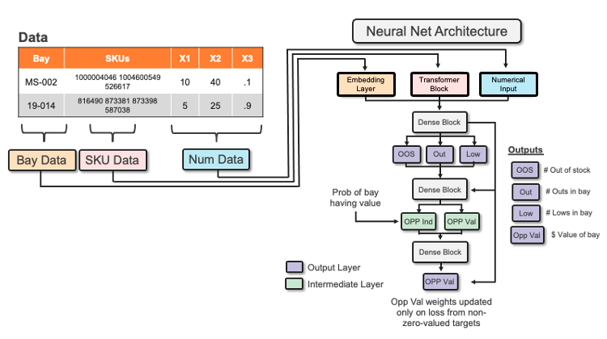

<!-- PROJECT LOGO -->
 

  

  <h3 align="center">Bay Packdown Machine Learning Model</h3>
  

    Documentation for the Bay Packdown Model

<!-- TABLE OF CONTENTS -->

  <h3 
 Table of Contents
</h3>
  <ol>
    <li><a href="#about-the-project">About The Project</a></li>
    <li><a href="#Code-and-Model-Structure">Code and Model Structure</a></li>
    <li><a href="#Data-Preprocessing">Data Preprocessing</a></li>
    <li><a href="#Data-Definitions">Data Definitions</a></li>
    <li><a href="#Inference">Inference</a></li>
    <li><a href="#Post-Inference-Data-Processing">Post Inference Data Processing</a></li>
    <li><a href="#Contact">Contact</a></li>
  </ol>

<!-- ABOUT THE PROJECT -->
## About The Project

_Problem_:

When we don’t maintain product availability that meets customer demand in our bays, we lose sales and negatively impact the customer experience. Moreover, our current tools do not effectively allocate labor resources to the most valuable bays for pack down.
 

_Hypothesis_:

We hypothesize that by leveraging a variety of data sources coupled with machine learning, we can direct our associates to the most valuable pack down opportunities on a given day, which will increase labor productivity, product availability, and sales. 

_Overview_:

This repository contains the production scripts/Plexus DS code that builds a single neural network that makes bay level predictions for bay packdown tasks.
The model outputs 5 different predictions:
   1. OOS - The number of predicted OOS SKUs in a bay
   2. Out - The number of shelfouts in a bay
   3. Low - The number of lows (1 or 2 shelf OHs) in a bay
   4. Opp Indicator - Probability of whether a bay has packdown value or doesn't
   5. Opp Value - The predicted value of packing down a bay
  

### Code and Model Structure

The code is currently executed through two functions within the _run_local.py_ script.

| Function | Description |
| --- | --- |
| **training_fn** | Pulls data, preprocesses, and trains the model. Model evaluation metrics are stored in a historical bigquery table |
| **inference_fn** | Pulls prediction data, preprocesses data with trained sklearn transformer, and makes predictions |

-- add more about model architecture

### Data Preprocessing

Upon calling data from BQ, the table columns are split into numerical, categorical, exclude lists, and target label lists based on BQ table schema and the pipeline_config.local.yaml file. If a feature is listed in the filter list within the config yaml file, it is excluded from training and prediction.
In addition, target label columns specified within the regression or classification label lists are also excluded from data preprocessing.